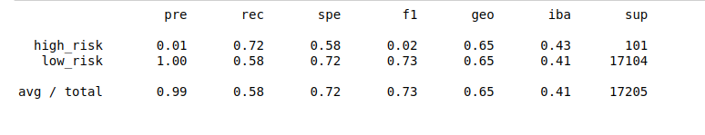
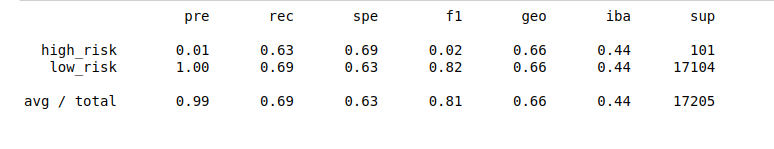
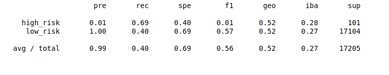
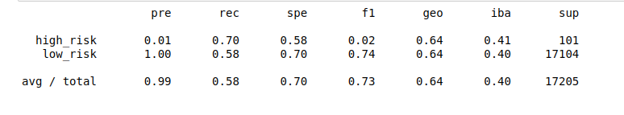
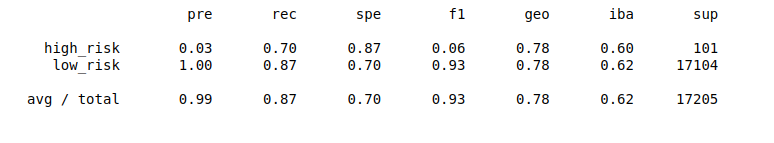
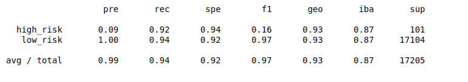

# Credit Card Risk Analysis

## Overview
In this project, I am working on the dataset provided by LendingClub, a peer-to-peer lending services company. The goal of our analysis is to build a machine learning model to classify loans to either risky or not.

Since good loans easily outnumber risky loans, the data is imbalanced. That's why this task is a little bit tricky. The imbalanced data forced me to implement some special techniques during both, training the models as well as evaluating them. For the training step, I train `Logistic Regression` model on different Oversampling, and Undersampling Techniques Including:
<ol>
<li>  Naive Random Over Sampling </li>
<li> SMOTE Over Sampling </li>
<li> Cluster Centroids Under Sampling </li>
<li> SMOTEEN Combination </li>
</ol>

In addition, we train another two models using the imbalanced data:
<ol>
<li>  Balanced Random Forest </li>
<li> Easy Ensemble Adaboost Classifier </li>
</ol>

Moreover, to evaluate the model, we use Balance Accuracy Score, as well as the imbalanced Classification Report.

In the next section we are discussing the obtained results for each of the conducted experiments

## Results

In this section we discuss the results found during conducting our analysis.

#### Balanced Accuracy

*Note: LR stands for Logistic Regression*
|Technique|  Balanced Accuracy|
|--|--|
| LR with RandomOverSampling | 65% |
| LR with SMOTE | 66% |
| LR with ClusterCentroids | 54% |
| LR with SMOTEENN | 64% |
| Balanced Random Forest |  79%|
| Easy Ensemble Adaboost | 93% |
Table 1. The Balanced accuracy obtained with the six experiments
#### Imbalanced Classification Report
In this subsection, the Imbalanced Classification Report for each of the six conducted experiments is reported:

##### LR with RandomOverSampling

##### LR with SMOTE

##### LR with ClusterCentroids

#####  LR with SMOTEENN

##### Balanced Random Forest

##### Easy Ensemble Adaboost

## Summary

Oversampling techniques is way better than the undersampling ones and perform nearly the same as the cobination algorithms. However, Balanced RF and Easy Ensemble Adaboost obtained results that surpassed those obtained during using over/under sampling techniques. Despite EE Adaboost takes more inference time, it obtained the highest imbalanced accuracy. That's why EE Adaboost is highly recommended for this task.
